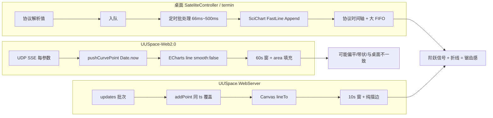

# 曲线绘制形态对比分析

> 对比对象：桌面端 **SateliteController**、**termin**、旧版 Web **UUSpace.WebServer**、当前 Web **UUSpace-Web2.0**  
> 目的：说明为何用户感觉「桌面是锯齿波、旧 Web 也是锯齿波、当前 Web 形态不一致」，并给出对齐方向。

---

## 1. 结论摘要

| 维度 | SateliteController | termin | UUSpace.WebServer（旧） | UUSpace-Web2.0（当前） |
|------|------------------|--------|-------------------------|------------------------|
| 绘图引擎 | SciChart（FastLine） | SciChart（FastLine） | **Canvas 2D 折线** | **ECharts 折线** |
| 几何连接 | 两点直线（非 step） | 两点直线 | `lineTo` 直线 | `smooth: false` 直线 |
| 是否数字阶梯线 | `IsDigitalLine = false` | 未启用 step | 无（纯折线） | 无（曾误用 `step`/`smooth`） |
| X 轴时间 | **协议源时间**（Unix→本地） | **SourceTime** | 批次 `tsUnixMs` | **本机 `Date.now()`** |
| 刷新节奏 | ~66ms 批处理 Append | 500ms 定时 Refresh | rAF + 每次 updates | 50ms flush + UDP 入站 |
| 缓冲规模 | ~72k 点/通道（2h） | 10 万点/通道 FIFO | 2000 点/序列/窗 | **1800 点/通道** |
| 默认时间窗 | **7200s（2h）** | 60 分钟 | **10s** | **60s** |
| Y 轴 | 自研滑动 min/max（带迟滞） | SciChart AutoRange | 可见窗内 min/max + 8% 边距 | 全序列 min/max + 8% 边距 |
| 填充区域 | 无（线为主） | 无 | 无 | **有 areaStyle（半透明）** |

**核心结论：**

1. 桌面端与旧 Web 的「锯齿波」外观，主要来自 **遥测值本身是阶跃变化的工程量**，再用 **直线连接相邻采样点** 后，在屏幕上呈现「斜边 + 水平段」交替——这是折线表现，不是 SciChart 的 `IsDigitalLine` 阶梯模式。
2. 旧 Web（Canvas）锯齿感往往 **更强、更利**：无面积填充、默认 **10s 短窗**、批次共时间戳、Y 轴随 `dataTick` 重算，尖角更明显。
3. 当前 Web2.0 若看起来「不像锯齿」或「像平线/糊线」，常见原因是：**时间轴用本机到达时间、60s 长窗压缩形态、area 填充柔化视觉、点数不足、或曾开启 smooth 平滑**——而非桌面用了另一种曲线算法。

---

## 2. 什么是用户口中的「锯齿波」

在遥测场景里，典型信号是 **阶跃序列**：

```
值 ^
   |     ┌──────
   |    /
   |───/
   +──────────> 时间
```

- 采样间隔内数值保持不变 → 水平段  
- 参数跳变 → 竖直或接近竖直的边  
- 用直线连接各采样点 → 屏幕上即 **锯齿/折线波**

因此：

- **锯齿波 ≠ 必须用 `step: 'end'` 或 `IsDigitalLine = true`**
- **锯齿波 = 保留每个采样点 + 直线连接 + 时间轴与 Y 轴不过度「美化」**

---

## 3. 桌面端 SateliteController

### 3.1 技术栈与线型

- 主路径：`ChartingWpf\RealtimeCurveHost.cs` + `SciChartHostedCurvePanel.cs`
- 序列类型：`FastLineRenderableSeries`
- 关键配置：`IsDigitalLine = false` → **普通折线**，非数字阶梯线
- `ResamplingMode.Auto`：仅在 **绘制像素不足** 时由 SciChart 做显示级抽稀，不改变物理采样语义

### 3.2 数据管道

```
UDP/协议解析 → 每帧入队 ConcurrentQueue
            → 定时器 ~66ms 批量消费（每 tick 最多 256 帧，预算 6ms）
            → IngestRealtimeFrames（按通道缓存）
            → RefreshChart → XyDataSeries.Append(x[], y[])
```

- **每包入队、定时批绘**：避免 UI 线程被 25fps 全量刷新拖死  
- **同一 plotTime 同通道只保留最后一个 Y**（同刻合并）  
- 队列过大时 **丢弃旧帧**（tail 保留），保证实时性

### 3.3 时间与缓冲

| 参数 | 典型值 |
|------|--------|
| X 轴模式 | `SourceUnixAsAxisLocal`（协议 Unix 秒 → 本地时间） |
| 单调性 | 同刻/回退时 +1 tick，避免竖线簇叠 |
| FifoCapacity | 约 **72000 点/通道**（按 2h、100ms/点估算） |
| 可见时间窗 | 默认 **7200s** |

### 3.4 Y 轴

- `UpdateVisibleYAxis()`：**滑动窗口内 min/max**，扩张快、收缩慢（迟滞 + lerp）  
- 避免 Y 轴每帧剧烈跳动，但仍能跟上阶跃变化

### 3.5 形态小结

- 与 termin 同源思路，工程上更激进：**更高刷新率、更大缓冲、协议时间轴、同刻合并**  
- 用户看到的「SciChart 锯齿波」= **FastLine + 阶跃遥测 + 协议时间轴**

---

## 4. 桌面端 termin

### 4.1 技术栈

- SciChart 6.x（WPF），逻辑见反编译 `CurveLineModel.cs` / `ChartModel.cs`  
- `FastLineRenderableSeries`，`ResamplingMode.Auto`，**未设数字阶梯线**

### 4.2 数据管道

```
属性回调（高频）→ _tempTPointsQueue 入队
              → Timer 500ms → CurveLineModel.Refresh → Append
```

- 与 SateliteController 相比：**刷新更慢（500ms）**，架构更简单  
- X 轴：`newValue.SourceTime`（**协议源时间**）  
- 缓冲：`FifoCapacity = MaxPointCount`，默认 **100000**  
- 显示跨度：`DisplaySpan` 默认 **60 分钟**

### 4.3 形态小结

- 同样是 **直线连接采样点**  
- 刷新较慢时，短时阶跃在屏上可能更像「一段一段的台阶」，仍非 ECharts `step` 语义

---

## 5. 旧版 Web：UUSpace.WebServer

### 5.1 技术栈

- **无 ECharts / SciChart**  
- `wwwroot\app.js` 中 `renderCurveLike()` 使用 **Canvas 2D** `moveTo` / `lineTo` 描边

### 5.2 绘图代码特征（锯齿友好）

```javascript
// 逐可见点直线连接，无 smooth，无 step
ctx.lineWidth = 1.5;
ctx.moveTo(x, y);
ctx.lineTo(x, y);
ctx.stroke();
```

- 默认 `windowSec: **10**`（短窗，阶跃在像素上更「陡」）  
- `maxPointsPerSeries: 2000`  
- **无 area 填充**，只有线条，尖角清晰

### 5.3 数据入点

- WebSocket `type: "updates"`，`addPoint(index, tsUnixMs, v)`  
- **同一 index、同一 `t` 只覆盖不追加**（同批次共 `tsUnixMs`）  
- `now = lastUpdateTsUnixMs`，X 轴为 **`[now - windowSec, now]`** 滚动窗  
- Y：`dataTick` 变化时按可见点重算 `yMin/yMax`（8% padding）

### 5.4 为何旧 Web「看起来就是锯齿波」

| 因素 | 效果 |
|------|------|
| 纯折线描边 | 每个跳变形成明显折角 |
| 10s 短窗 | 同样跳变占用更多横向像素 → 更「尖」 |
| 批次时间戳 | 多点同一 X 时合并，但跨批次仍是阶跃 |
| 动态 Y 缩放 | 幅度变化时整线上下跳，强化锯齿感 |
| 无平滑/无面积 | 不掩盖棱角 |

---

## 6. 当前 Web：UUSpace-Web2.0

### 6.1 技术栈

- **ECharts 5**（`modules/curve-chart/curve-chart.js`）  
- `type: "line"`，`smooth: false`，`sampling: "none"`  
- **带 `areaStyle` 半透明填充**（旧 Web / 桌面线型均无此效果）

### 6.2 当前配置摘要

| 项 | 当前值 | 文件 |
|----|--------|------|
| 刷新 | `CURVE_FLUSH_INTERVAL_MS = 50` | `curve-chart.js` |
| 缓冲上限 | `CURVE_MAX_POINTS = 1800` | `curve-chart.js` |
| 时间窗 | `CURVE_WINDOW_MS = 60_000`（60s） | `curve-chart.js` |
| X 时间来源 | `pushCurvePoint(..., parsePacketTimeMs(packet.time))` | `app.js` `syncPacketValues` |
| 单调时间 | `nextCurveSampleTime` 每通道 +1ms | `app.js` |
| 线型 | `smooth: false` | `curve-chart.js` |

### 6.3 与桌面/旧 Web 的主要差异（形态不一致的原因）

#### （1）X 轴：本机到达时间 vs 协议源时间

- **桌面 / termin**：`SourceTime` / 协议 Unix → 与波形在总线上的真实时刻一致  
- **Web2.0**：`Date.now()` 到达时间 → 网络抖动、解析批次、浏览器事件循环会使点 **在时间上挤在一起或拉开**  
- 同一参数若在包内连续更新，Web2.0 用 `+1ms` 拉开，可能形成 **密垂直小段**，与桌面「同刻合并为一个点」不同

#### （2）时间窗：60s vs 7200s / 10s

- **60s 长窗**：同样 5 秒内的阶跃，在屏上只占约 1/12 宽度 → **看起来更平、更短**  
- **旧 Web 10s 窗**：阶跃更「铺满」屏幕 → **锯齿更明显**  
- **桌面 2h 窗**：看长期趋势，局部仍可见台阶，但缩放级别不同

#### （3）点数与抽稀

- Web2.0 仅 **1800 点/通道**；桌面可达 **数万～十万**  
- 高频遥测下 Web 端会 **丢旧点**（`trimCurveBuffer`），形状可能从密锯齿变成 **稀疏折线或近似平线**

#### （4）视觉：面积填充

- `areaStyle: { opacity: 0.22 }` 在折线下方填色，人眼更易感知为 **「带状平滑区域」**，削弱「纯折线锯齿」印象  
- 旧 Canvas 仅 `stroke`，无填充

#### （5）历史实现问题（已部分修复）

| 问题 | 影响 |
|------|------|
| 曾设 `smooth: 0.22` | 阶跃被抹成斜线，像「没有锯齿」 |
| 曾设 `step: 'end'` | 阶梯语义与桌面 FastLine 不一致 |
| `needsRender` 跳过 flush | 有轴无线（已按 git 197247d 改回全量 setOption） |
| `APP_VERSION` 未 import | 脚本中断，整页功能失效（已修） |

---

## 7. 对照关系图



---

## 8. 对齐建议（若要与桌面/旧 Web 一致）

优先级从高到低：

| 优先级 | 项 | 建议 | 参考 |
|--------|----|------|------|
| ~~P0~~ ✅ | X 轴时间 | 已改用 **协议包时间** `packet.time`（Unix ms），同刻同通道合并末值 | `appendCurveSampleCoalesced`、`syncPacketValues` |
| ~~P0~~ ✅ | 线型视觉 | 已去掉 `areaStyle`；保持 `smooth: false` | `buildCurveOption` |
| P1 | 时间窗 | 默认改为 **7200s**（UI-01 已规划）；短窗改用户可选 | 桌面 `WaveSetConfigure` |
| P1 | 缓冲 | 提高到 **72000** 点 + 抽稀策略 | 桌面 FIFO |
| P2 | 刷新 | 入队每包、**66~150ms** 批处理 flush（不必每包 setOption） | Satelite 66ms |
| P2 | Y 轴 | 滑动窗 min/max + 扩张快/收缩慢 | `UpdateVisibleYAxis` |
| ~~P3~~ ✅ | 同刻合并 | 已在 P0 通过 `appendCurveSampleCoalesced` 实现 | 两桌面均有 |

**不建议** 为了「像锯齿」而长期开启 ECharts `step: 'end'`，除非产品明确要求 **数字阶梯显示**（与 SciChart `IsDigitalLine` 等价）；桌面默认并非该模式。

---

## 9. 验证方法

1. 选 **缓慢阶跃** 的遥测参数（如开关量、模式字某一 bit）。  
2. 桌面 SciChart 与 Web2 同参数同屏对比。  
3. Web 控制台：`UUSPACE_API.debugCurve()` 查看 `bufferPointCount`、`bufferLast3`。  
4. 临时将 Web2 `CURVE_WINDOW_MS` 改为 `10000`、`areaStyle` 关掉，若锯齿感明显增强，即可验证本文差异分析。

---

## 10. 参考文件索引

### SateliteController

- `D:\UUSpace1.0.0\SateliteController\ChartingWpf\RealtimeCurveHost.cs`
- `D:\UUSpace1.0.0\SateliteController\AppControls\MenuPage\Wave\SciChartHostedCurvePanel.cs`
- `D:\UUSpace1.0.0\SateliteController\AppControls\Items\Data\WaveSetConfigure.cs`

### termin

- `D:\AllenShaoProject\termin\实时曲线绘制-设计梳理.md`
- `D:\AllenShaoProject\termin\_decompiled\AtpComponent\...\CurveLineModel.cs`

### UUSpace.WebServer

- `D:\UUSpace1.0.0\UUSpace.WebServer\wwwroot\app.js`（`addPoint`、`renderCurveLike`）
- `D:\UUSpace1.0.0\UUSpace.WebServer\Program.cs`（`TelemetryHub`、ingest）

### UUSpace-Web2.0

- `modules\curve-chart\curve-chart.js`（`buildCurveOption`）
- `app.js`（`pushCurvePoint`、`syncPacketValues`、`flushCurveChartsNow`）
- `docs\tasks\M2-曲线绘制.md`、`docs\tasks\UI-交互增强.md`（UI-01 7200s/24h）

---

## 11. 修订记录

| 日期 | 说明 |
|------|------|
| 2026-05-19 | 初版：四端对比与形态差异原因分析 |
| 2026-05-19 | P0 落地：协议时间轴、同刻合并、去除 areaStyle |
