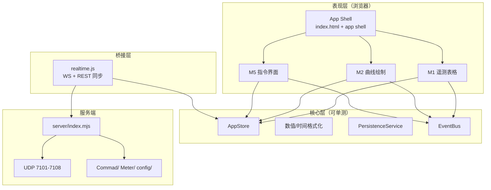
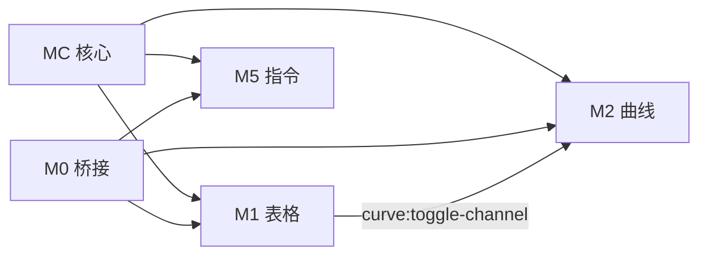
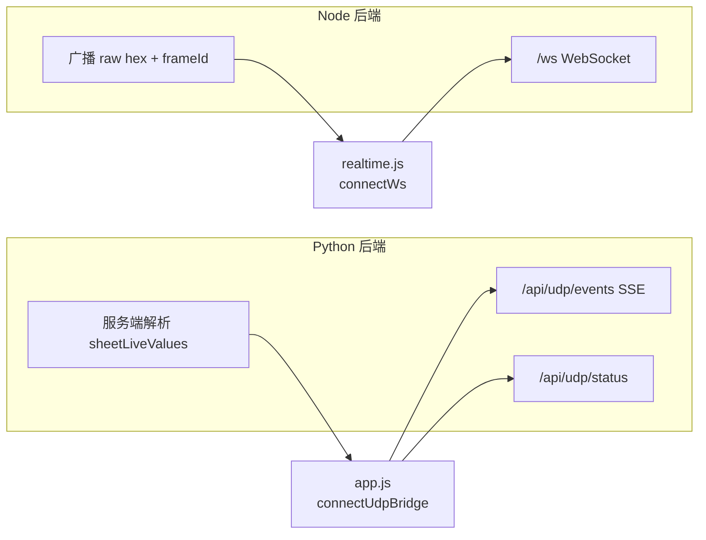

# UUSpace Web 2.0 — 详细设计文档

> **输入**：[需求文档.md](./需求文档.md)  
> **业务能力基准**：桌面软件 `SateliteController`（C#）— 协议、数据列、组包规则等可对齐  
> **UI/UX 基准**：**现有 Web 端**（`index.html` Mission Workspace + `styles.css` + `app.js` 各 `render*`）— **不参照、不复刻桌面 WinForms/WPF 界面**  
> **现状**：Web 端 `app.js` + `realtime.js` + `server/index.mjs`（或 `tools/udp_web_server.py`）  
> **文档日期**：2026-05-18  
> **状态**：**1.0 冻结版**（§10 全部决策已确认，可进入开发）

---

## 目录

1. [文档范围与原则](#1-文档范围与原则)
2. [系统架构总览](#2-系统架构总览)
3. [模块划分与依赖](#3-模块划分与依赖)
4. [模块详细设计](#4-模块详细设计)
5. [跨模块能力](#5-跨模块能力)
6. [数据持久化与配置](#6-数据持久化与配置)
7. [接口契约汇总](#7-接口契约汇总)
8. [独立测试策略](#8-独立测试策略)
9. [实施阶段建议](#9-实施阶段建议)
10. [决策记录](#10-决策记录)

---

## 1. 文档范围与原则

### 1.1 纳入范围（来自需求文档）

| 需求章节 | 是否开发 | 说明 |
|----------|----------|------|
| §1 遥测表格 | **是** | 列配置、列宽、小数位、科学计数法、右键菜单（不含 Ctrl+A） |
| §2 曲线绘制 | **是** | 悬停引导线、运行/暂停、缩放平移、导出、标题编辑；历史弹窗（低） |
| §3 状态显示 | **否** | 需求明确：Web 端暂时不改动 |
| §4 源码显示 | **否** | 需求明确：Web 端暂时不改动 |
| §5 指令界面 | **是** | 指令链、可参数化模板、执行日志、进度、链编辑（中/低） |
| §6 快捷键 | **否** | 产品确认：需求中快捷键已删除；**不实现** F5/F6 等键盘快捷键；运行/暂停等仅用工具栏按钮 |

### 1.2 设计原则

#### 1.2.1 Web UI 设计约束（强制）

> **本期及后续迭代：Web 端界面设计一律沿用现有 Web 实现方式，不参照桌面端 UI 设计。**

| 维度 | 要求 | 禁止 |
|------|------|------|
| **整体布局** | 保持 Mission Workspace：`mission-bar` + 左 Dock 摘要/告警 + 中央 `stage` + 底栏状态流 | 照搬桌面主窗体、dock 面板、菜单栏结构 |
| **视觉样式** | 延续 `styles.css` 暗色主题、现有组件类名（`ghost-button`、`segment`、`command-card` 等） | 复刻桌面控件外观、字体、配色、对话框样式 |
| **交互模式** | 现有 Web 习惯：Sheet 标签、卡片网格、两步确认发送、工具栏按钮（无桌面快捷键） | 引入桌面专属交互（如通道树拖入、SciChart 右键菜单体系） |
| **新功能落地** | 在**当前视图内增控件**（工具栏项、Modal、右键菜单、内联编辑），与相邻模块视觉一致 | 为对齐桌面而新增独立“桌面风”窗口或控件库 |

**与桌面对齐的边界**（仅指**数据与业务**，不是界面）：

- 遥测列语义、指令表列（如 E 列 `DataSrc`）、`cmdchain.txt` 格式、UDP/协议解析可与桌面对齐。
- 组包算法、公式、状态判定等实现可参考 C# 源码。
- **呈现方式**（表格是否自绘、曲线是否 SciChart 布局）以 Web 现有 `renderTelemetryTable` / `renderCurve` / `renderCommandCenter` 为准演进。

**验收口径**：新需求评审时先问「现有 Web 哪一屏扩展」，而非「桌面哪一屏长什么样」。

#### 1.2.2 工程原则

1. **模块独立**：各业务模块通过明确的「状态切片 + 事件总线 + 渲染入口」交互，避免直接读写他模块 DOM。
2. **可测**：每个模块提供 `createXModule(deps)` 工厂，依赖可注入 Mock（store、api、clock、canvas）。
3. **渐进重构**：不要求一次性拆分全部 `app.js`；按模块落地时抽离到 `modules/<name>/` 目录，保留 `app.js` 作为壳层编排。
4. **以 `app.js` 为交付主体**：业务与 UI 逻辑集中在 `app.js`（编排）+ `realtime.js`（桥接）；后端仅补齐前端已调用的 REST/WS 契约。
5. **已确认项以 §10.1 为准**；§10.2 无待确认项；变更需书面确认。
6. **UI 只进化、不换壳**：见 §1.2.1；ECharts 等新技术仅替换绘图引擎，外层布局与 Web 组件体系不变。

### 1.3 与现有代码的对应关系

| 现有文件 | 职责 | 重构方向 |
|----------|------|----------|
| `index.html` | 壳布局：顶栏、Dock、Stage、状态流 | **不改整体信息架构**；各模块向 `#stage` 挂载片段（§1.2.1） |
| `app.js` | 全局 `state`、`render*`、曲线/表格/指令、事件绑定 | **主战场**；按模块渐进抽到 `modules/*`，壳层仍驻留 `app.js` |
| `realtime.js` | `fetch` 协议/指令/遥测表、WS 帧、`mapCommandRow` | 保留；继续通过 `window.UUSPACE_API` 与 `app.js` 协作 |
| `server/index.mjs` | Node 后端：`npm run dev` 默认入口；HTTP 静态 + UDP + **WebSocket** | **设计上的主后端**；须补齐与 Python 对齐的 API（见 §4.2.0） |
| `tools/udp_web_server.py` | Python 后端：**Docker 默认入口**；HTTP 静态 + UDP + **SSE** + 服务端遥测解析 | 现网完整能力参考实现；详见 §4.2.0 |
| `styles.css` | 全局与视图样式 | 按模块增加 BEM 前缀类名，避免污染 |

#### 1.3.1 后端说明写在哪份文档

| 内容类型 | 文档 | 说明 |
|----------|------|------|
| 架构、双后端差异、API 对照、前端走 SSE/WS | **本文 §4.2.0** | 设计与开发依据 |
| 启动命令、端口、绑定 IP、Docker、排错 | **README.md** | 操作手册 |
| 与桌面 `DataGenerateUDP` / `DataRelayService` 映射 | **开发对照表.md** | 一行职责对照即可 |
| 开发勾选任务 | **docs/tasks/M0-实时桥接.md** | 仅引用，不展开实现 |

---

## 2. 系统架构总览

### 2.1 逻辑分层



### 2.2 运行时数据流（遥测 → 表格/曲线）

1. UDP 报文进入 `server/index.mjs`，匹配 `config/protocol.json` 规则后 `broadcast({ type: 'udp', ... })`。
2. `realtime.js` 收 WS，解析遥测项，更新 `sheetLiveValues` / `pushCurvePoint`。
3. **M1** 订阅 `telemetry:row-updated`，原地更新表格单元格（保留现有 flash 策略）。
4. **M2** 订阅 `telemetry:point`，写入 `curveBuffers[code]`，由 `requestAnimationFrame` 触发 `drawCurveCanvas`。

### 2.3 指令发送数据流（目标态）

1. 用户在 **M5** 选择单条指令或指令链 → 必要时弹出参数表单（DataSrc=-1）。
2. 前端组装 `{ target, port, data: hex }` 或链式 `{ chainId, steps[] }`。
3. **POST** 服务端发送 UDP；服务端写执行日志并返回逐步结果。
4. **M5** 更新 UI：单条结果徽章 / 链式进度条。

---

## 3. 模块划分与依赖

### 3.1 模块清单

| 模块 ID | 名称 | 需求来源 | 独立测试 | 依赖 |
|---------|------|----------|----------|------|
| **M0** | 实时桥接与协议 | 对照表、现有 WS | 集成测 | `server/index.mjs` |
| **M1** | 遥测表格 | 需求 §1 | 单元 + DOM | M0（遥测数据）、Persist |
| **M2** | 曲线绘制 | 需求 §2 | 单元 + Canvas | M0、M1（通道勾选事件，可选） |
| **M3** | 状态显示 | 需求 §3 | — | **本期不开发** |
| **M4** | 源码显示 | 需求 §4 | — | **本期不开发** |
| **M5** | 指令界面 | 需求 §5 | 单元 + API mock | M0、服务端发送 API |
| **MC** | 核心公共服务 | — | 单元 | 无 |

> **M6 快捷键**：本期**不立项**（需求 §6 已删除；不实现 F5/F6/Ctrl+A 等）。

**M3/M4**：维持 `renderStatus()` / `renderHexBytes()` 现状，不纳入本期接口变更。

### 3.2 模块依赖图（本期开发）



### 3.3 建议目录结构（落地时）

```
modules/
  core/
    store.js
    event-bus.js
    persistence.js
    format.js
  telemetry-table/
    index.js
    column-config.js
    context-menu.js
    __tests__/
  curve-chart/
    index.js
    viewport.js
    hover-guide.js
    export.js
    __tests__/
  command-center/
    index.js
    chain-runner.js
    param-form.js
    log-panel.js
    __tests__/
app.js          # 壳：init、switchView、组装 modules
realtime.js     # M0 客户端部分
```

---

## 4. 模块详细设计

### 4.1 MC — 核心公共服务

#### 4.1.1 AppStore

- **职责**：替代当前散落的全局 `state` 可变对象；按模块划分命名空间。
- **建议切片**：

```javascript
// 示意 — 最终以实现为准
{
  ui: { activeView, ... },
  telemetry: { activeSheet, tableViews, columnPrefs, decimalPrefs, ... },
  curve: { curveViews, curveBuffers, viewportByViewId, paused, ... },
  command: { selectedId, category, filter, chainRun, logs, ... },
  bridge: { udpBridge, sheetLiveValues, ... }
}
```

- **API**：`getState()`、`subscribe(listener)`、`patch(namespace, partial)`。
- **与现有代码**：`createStore`（`app.js` L236）可演进为正式 Store，避免双轨。

#### 4.1.2 EventBus

| 事件名 | 发布方 | 订阅方 | 载荷 |
|--------|--------|--------|------|
| `view:changed` | Shell | M1,M2,M5 | `{ viewId }` |
| `telemetry:point` | realtime | M2 | `{ code, value, time }` |
| `curve:toggle-channel` | M1 | M2 | `{ code, selected }` |
| `curve:viewport-changed` | M2 | M2（自绘） | `{ viewId, xMin, xMax }` |
| `command:sent` | M5 | M5 | `{ commandId, ok, ... }` |
#### 4.1.3 数值格式化（`format.js`）

统一实现需求中的显示规则，供 M1、M2 共用：

| 函数 | 行为 | 需求优先级 |
|------|------|------------|
| `formatTelemetryNumber(value, { decimals })` | `decimals === -1` → 8 位有效数字；0–12 → 固定小数；\|v\|>1e8 或 <1e-4 → 科学计数法 | 高/中 |
| `formatAxisNumber(value)` | 坐标轴刻度简化 | 中 |
| `formatRawHex(value)` | 已有 `formatRawHex`，迁入 MC | — |

**现状差距**：`formatValue`（`app.js` L1911）仅做简单 `toFixed`，需替换为上述规则。

#### 4.1.4 PersistenceService

- **存储介质**：`localStorage`（键前缀 `uuspace.web2.`）。
- **本期持久化项**：

| 键 | 内容 | 模块 |
|----|------|------|
| `telemetry.columns` | 列可见性、顺序、宽度 | M1 |
| `telemetry.decimals` | `Record<code, number>`，-1 表示自动 | M1 |
| `telemetry.tableViews` | 自定义表格视图 | M1（已有 `tableViews`，需持久化） |
| `curve.views` | 曲线页列表、通道、标题 | M2 |
| `curve.viewport` | 每 viewId 的 x/y 范围、paused | M2 |
| `command.favorites` | 收藏指令 ID 列表 | M5（低优先级） |

---

### 4.2 M0 — 实时桥接与协议（维持 + 小扩展）

#### 4.2.0 双后端实现（`tools/udp_web_server.py` vs `server/index.mjs`）

仓库内存在两套可独立启动的 HTTP+UDP 桥接，**前端 `app.js` 为主**，二者需逐步 API 对齐。日常说明分工见 §1.3.1。

##### 角色定位

| 实现 | 路径 | 典型启动方式 | 定位 |
|------|------|--------------|------|
| **Python 完整栈** | `tools/udp_web_server.py` | `python tools/udp_web_server.py …`、**Dockerfile CMD** | 现网/Docker **默认**；含服务端遥测解析、SSE、`command/send` |
| **Node 开发栈** | `server/index.mjs` | `npm run dev` / `npm start`（默认端口见 `UUSPACE_PORT`，如 3980） | **设计上的主后端**；轻量 WS 广播，多项 API 待补齐 |

> 代码文件暂位于 `tools/`，因历史原因命名像「工具」；实质为生产级后端。后续可迁至 `server/udp_web_server.py` 仅作目录整理，**不改变**本文职责划分。

##### 能力对照

| 能力 | Python | Node |
|------|:------:|:----:|
| 静态资源（`index.html`、`app.js` 等） | ✅ | ✅ |
| UDP 监听 7101–7108 | ✅ | ✅ |
| `URLY` V1/V2/V3 解包 | ✅ | ❌ |
| 服务端按遥测大表解析路序/公式/状态 | ✅ | ❌ |
| 实时推送 **SSE** `/api/udp/events` | ✅ | ❌ |
| 实时推送 **WebSocket** `/ws` | ❌ | ✅ |
| `GET /api/udp/status`（端口统计、`sheetLiveValues` 等） | ✅ | ❌ |
| `GET /api/telemetry/definitions` | ✅ | ❌ |
| `GET /api/protocol`、`/api/satellites`、`/api/meter/:file` | ✅ | ✅ |
| `GET /api/commands`（xls 或 `commands.json`） | ✅ 偏 json | ✅ 读 xls |
| `GET /api/cmdchain` | ✅ | ✅ |
| `POST /api/command/send` | ✅ | ❌（**P0 须在 Node 补齐**） |

##### 前端分别走哪条路



| 前端文件 | 机制 | 依赖后端 | 行为摘要 |
|----------|------|----------|----------|
| **`app.js`** | `fetch('/api/udp/status')` + `EventSource('/api/udp/events')` | **Python** | 连接管理、表格 `sheetLiveValues`、服务端已解析的 `parsed.values` |
| **`realtime.js`** | `WebSocket` + `cfg.websocketPath`（`config/protocol.json` 中为 `/ws`） | **Node** | 帧计数、状态流文案；与 `applyProtocol` 更新端口列表 |
| **`app.js`** | `fetch('/api/command/send')` | 有该接口的后端 | 指令发送；Docker/Python 可用，**Node 当前 404** |

因此：

- 只跑 **`npm run dev`** 时：往往 **WS 有数据**，但 **`/api/udp/status` 失败** → `connectUdpBridge` 走 catch，表格完整刷新、指令发送可能不全。
- 只跑 **Python** 时：**SSE + 完整遥测** 正常；顶栏 WS 状态可能显示「SSE UDP桥接」（`realtime.js` 无 `websocketPath` 时）。
- **Docker 现网**：以 Python 为准（见根目录 `Dockerfile`）。

##### 共用配置与数据目录

| 资源 | 路径 |
|------|------|
| 协议规则 | `config/protocol.json` |
| 指令表 | `Commad/指令列表.xls`、`Commad/commands.json`（export 生成） |
| 指令链 | `Commad/cmdchain.txt` |
| 遥测大表 | `Meter/*.xlsx`（Docker 常挂载外部 `/meter`） |

##### 演进目标（与 Q-01 一致）

1. **短期**：以 `tools/udp_web_server.py` 为 Docker/联调 **能力标杆**；在 `server/index.mjs` 补齐 `app.js` 已调用的 API（至少 `POST /api/command/send`，可选 `GET /api/udp/status` 或改为前端统一 WS 解析）。
2. **中期**：Node 与 Python **API 契约一致**，`npm run dev` 与 Docker 行为可互换。
3. **长期**：视维护成本决定保留 Python 或仅作 legacy；**不在需求文档中写实现路径**，以本文与 README 为准。

##### 其它文档中的引用

- **README.md**：只写如何启动、端口、验证步骤，不重复上表。
- **开发对照表.md**：`DataGenerateUDP` / `DataRelayService` → `tools/udp_web_server.py`。
- **docs/tasks/M0-实时桥接.md**：实现任务 checklist，指向本节与 Python 源码对照。

#### 4.2.1 现状（摘要）

- `realtime.js`：拉取 `/api/protocol`、`/api/commands`、`/api/cmdchain`；有 `/ws` 时走 WebSocket。
- `app.js`：`connectUdpBridge()` 依赖 Python 提供的 `/api/udp/status` 与 SSE（见 §4.2.0）。
- `server/index.mjs`：UDP → WS；**当前无** `/api/command/send`、`/api/udp/status`。

#### 4.2.2 本期扩展（对齐 `app.js` 已有调用）

| API | 方法 | 说明 |
|-----|------|------|
| `/api/command/send` | POST | 单条 UDP 发送；**`app.js` `sendCommand()` 已调用**；须在 `server/index.mjs` 实现（可参考 `udp_web_server.py`） |
| `/api/command/chain/run` | POST | 服务端顺序执行链（推荐，便于日志与延时） |
| `/api/command/logs` | GET | 分页查询执行日志（若需持久化） |
| `/api/cmdchain` | GET/PUT | 读/写 `Commad/cmdchain.txt`（链编辑，中优先级） |

#### 4.2.3 独立测试

- **单元**：`readCmdchain` 解析 Tab 分隔行（category, name, commandIds, weight）。
- **集成**：Mock UDP socket，断言 POST body 发出正确字节。

---

### 4.3 M1 — 遥测表格

#### 4.3.1 功能清单与优先级

| ID | 功能 | 优先级 | 设计要点 |
|----|------|--------|----------|
| T-01 | 列显示/隐藏 | 高 | 列定义表驱动渲染；设置面板勾选；写入 `telemetry.columns` |
| T-02 | 列宽拖动 | 高 | 表头 `resize-handle`；`pointerdown/move/up`；最小宽 48px |
| T-03 | 小数位数 | 中 | 右键菜单 → 子菜单：自动(-1)/0–12；按行 `code` 存 `decimalPrefs` |
| T-04 | 科学计数法 | 中 | 调用 `formatTelemetryNumber` |
| T-05 | 右键菜单 | 中 | 删除行（自定义视图）、小数位、列配置入口 |
| T-06 | Ctrl+A 全选 | — | **本期不做**（需求快捷键已删除） |

#### 4.3.2 列模型（建议默认）

**数据列**与桌面 `TeleTable` 字段语义对齐；**表格 UI** 仍为 Web 标准 `<table>` + `styles.css`，不做桌面自绘控件。列定义：

| columnKey | 标题 | 默认显示 | 可隐藏 |
|-----------|------|----------|--------|
| `select` | 曲线勾选 | 是 | 否 |
| `index` | 序号 | 是 | 是 |
| `code` | 代号 | 是 | 否 |
| `name` | 名称 | 是 | 否 |
| `unit` | 单位 | 是 | 是 |
| `formula` | 公式 | 否 | 是 |
| `value` | 当前值 | 是 | 否 |
| `hex` | 十六进制 | 否 | 是 |
| `status` | 状态 | 是 | 否 |
| `binary` | 二进制 | 否 | 是 |
| `wave` | 路序 | 否 | 是 |

**数据来源**：`mapDefinitionToRow` + `sheetLiveValues`（现有 `getTelemetryRowsForSheet` 流程）。

#### 4.3.3 渲染策略

- 保留「原地更新值单元格 + flash」：仅当 `activeView === 'telemetry'` 且行在 DOM 中时 `updateCell`；否则标记 dirty，切换视图时全量 `render`。
- 搜索/筛选（`dataFilter`、搜索框）逻辑保留在 M1 内，输出 `visibleRows` 供渲染。

#### 4.3.4 UI 组件

| 组件 | 触发 | 行为 |
|------|------|------|
| `ColumnConfigPanel` | 工具栏按钮 / 右键 | 勾选列、恢复默认 |
| `ContextMenu` | `contextmenu` on `tbody tr` | 定位行 code，显示 T-03/T-05 项 |
| `ResizeGuide` | 列头右缘 | 实时预览列宽 |

#### 4.3.5 状态着色

- **现状**：告警行高亮。
- **桌面**有三态行色；**Web（Q-02 已确认）**仅告警高亮，不引入桌面行色方案。
- **设计**：沿用现有 Web 告警样式；不新增「关注」行背景（除非后续产品单独要求）。

#### 4.3.6 模块对外 API

```javascript
export function createTelemetryTableModule({ store, bus, persist }) {
  return {
    id: 'telemetry',
    mount(stageEl) { /* renderTelemetryTable */ },
    unmount() { /* remove listeners */ },
    handleAction(action) { /* 列配置、右键命令 */ },
  };
}
```

#### 4.3.7 独立测试用例（示例）

| 用例 | 输入 | 期望 |
|------|------|------|
| 列隐藏 | 隐藏 `hex` | 表头/单元格无 hex 列 |
| 列宽持久化 | 拖宽 code 列 → 刷新 | localStorage 恢复宽度 |
| 小数位 | decimals=2, value=1.2345 | 显示 `1.23` |
| 科学计数 | value=1e9 | 含 `e` 或 `E` 格式（格式待 Q-03） |
| 筛选 | filter=告警 | 仅 status=告警 行 |

---

### 4.4 M2 — 曲线绘制

#### 4.4.0 技术选型（已确认：ECharts）

**结论**：本期曲线模块采用 **[Apache ECharts 5](https://echarts.apache.org/)**（可 CDN 或 npm 打包），替代自研 Canvas 2D 主路径。

| 维度 | 原生 Canvas 2D（现状） | ECharts | uPlot |
|------|------------------------|---------|-------|
| 悬停引导线 / Tooltip | 需自研命中检测 | **内置 axisPointer + tooltip** | 基础 tooltip |
| X 轴缩放 / 平移 | 需自研 viewport | **dataZoom**（inside + slider） | 内置缩放 |
| 导出 PNG | `toDataURL` | **`getDataURL` / toolbox saveAsImage** | 需插件 |
| 多曲线 / 多面板 | 已有 `curveViews` 网格 | 每面板一个 `echarts.init` 实例 | 轻量但 UI 组件少 |
| 包体积 | 无 | ~300KB（可按需 `echarts/core` 裁剪） | ~40KB |
| 与 Mission Workspace 暗色主题 | 已适配 | 需定制 `theme`（一次性） | 需定制 |

**实施要点**（写入 `modules/curve-chart/` 或 `app.js` 内聚封装）：

1. **实例生命周期**：与 `curveViews` 一一对应；`renderCurve` 时 diff DOM 容器，避免泄漏（`dispose` 已删面板）。
2. **实时更新**：WS 入站 → `pushCurvePoint` → 节流到 **≤10Hz** 调用 `appendData` / `setOption({ series: [...] })`，避免 25fps 全量重绘。
3. **运行/暂停（C-02）**：暂停时停止 appendData，保留最后一帧；工具栏按钮切换（**无键盘快捷键**）。
4. **视觉**：渐变面积、通道色沿用 `colorForCode`；ECharts `theme` 对齐 **`styles.css` / Mission Workspace**，不对齐桌面 SciChart 皮肤。
5. **回退策略**：若某面板无数据，保留现有空状态文案（「未选择曲线通道」）。

**不采用 ECharts 的场景**：仅当后续要求极致小包体（&lt;50KB）时再评估 uPlot；当前需求优先级下 ECharts 综合成本最低。

#### 4.4.1 功能清单

| ID | 功能 | 优先级 | 设计要点 |
|----|------|--------|----------|
| C-01 | 悬停引导线 | 高 | ECharts `tooltip` + `axisPointer: { type: 'line' }` |
| C-02 | 运行/暂停 | 高 | `curve.paused`；工具栏按钮；节流 `appendData` |
| C-03 | 缩放/平移 | 高 | `dataZoom` inside + slider（运行中默认可缩放 X） |
| C-04 | 导出 PNG | 中 | `chart.getDataURL()` 或 toolbox `saveAsImage` |
| C-05 | 标题编辑 | 中 | 面板标题 DOM 内联编辑 → `curveViews[].name` |
| C-06 | 历史弹窗 | 低 | brush/工具栏框选 → Modal 内第二 ECharts 实例 |

#### 4.4.2 视口模型（Viewport）

每个 `curveView` 维护：

```javascript
{
  xMode: 'window',      // 'window' | 'fixed-range'
  windowSeconds: 60,    // 与现有 "T-60s" 一致，可配置（待 Q-05）
  xOffset: 0,           // 平移偏移（点数或毫秒）
  yMin: null,           // null = 自动（当前全局 min/max）
  yMax: null,
  paused: false
}
```

- **缓冲**：维持环形缓冲；点数默认 180（现状），扩展窗口时需加大或按时间戳裁剪（待 Q-05）。
- **绘制管道**：`createCurveChart(container, view)` → ECharts option；废弃 `drawTrendChart` rAF 全量重绘主路径（迁移期可并存开关）。

#### 4.4.3 悬停引导线（C-01）

- 使用 ECharts 默认十字/竖线 `axisPointer`，`tooltip.formatter` 中列出各 `series` 的代号、工程值、时间。
- 时间轴：`xAxis.type = 'time'`，数据点 `{ value: [ts, val] }`。

#### 4.4.4 运行/暂停（C-02）

| 状态 | 数据写入 | 图表更新 | UI |
|------|----------|----------|-----|
| 运行 | `pushCurvePoint` 正常 | 节流 appendData | 工具栏「暂停」|
| 暂停 | 继续写入缓冲或丢弃（默认：继续写入但不滚动 X 轴） | 停止 setOption | 工具栏「运行」|

工具栏位置：曲线视图顶部，与现有 `curve-layout` 按钮同一工具条。**不绑定 F5/F6。**

#### 4.4.5 缩放与平移（C-03）

| 输入 | 条件 | 行为 |
|------|------|------|
| `wheel` + deltaY | 运行/暂停 | ECharts `dataZoom`；最大时间跨度 7 天（Q-05，业务能力参考桌面，交互为 Web 图表控件） |
| `pointerdown/move/up` | **仅暂停**（建议） | 水平平移 `xOffset` |
| 双击空白 | — | 可选：重置视口（待 Q-04） |

#### 4.4.6 历史弹窗（C-06，低）

1. 工具栏「历史选区」或 ECharts `brush` 框选 → 记录 `[t0, t1]`。
2. 从 `curveBuffers` **切片复制** 到 `historySnapshot`（主图继续实时）。
3. Modal 内独立 `echarts.init` 只读展示。

#### 4.4.7 与 M1 的协作

- 保留表格行勾选 → `curve:toggle-channel`；M2 监听后更新 `curveViews[].codes` 并 `setOption` 增删 series。
- M1 不依赖 ECharts 类型。

#### 4.4.8 独立测试

| 用例 | 方法 |
|------|------|
| option 构建 | 给定 2 条 series → `buildCurveOption` 含 2 个 series name |
| 暂停 gate | paused 时 `flushCurveUpdates` 不调用 |
| 导出 | mock `getDataURL` 返回非空 |

---

### 4.5 M5 — 指令界面

#### 4.5.1 功能清单

| ID | 功能 | 优先级 | 设计要点 |
|----|------|--------|----------|
| CMD-01 | 指令链执行 | 高 | 读 `cmdchain.txt`；按 `commandIds` 顺序；步间延时 |
| CMD-02 | 可参数化模板 | 高 | `DataSrc === '-1'` 时弹表单，组包后发送 |
| CMD-03 | 执行日志 | 高 | 时间戳、代号、目标、结果；UI 列表 + 可选服务端文件 |
| CMD-04 | 发送进度 | 中 | 链执行时 `step/total` 进度条 |
| CMD-05 | 链编辑 | 中 | 表格编辑 chains → PUT 保存 txt |
| CMD-06 | 批量发送 | 低 | 多选 + 间隔 |
| CMD-07 | 指令收藏 | 低 | `command.favorites` + 筛选入口 |

#### 4.5.2 指令链数据模型

**文件格式**（与 `readCmdchain` 一致）：

```
{category}\t{name}\t{id1,id2,...}\t{weight}
```

**内存模型**：

```javascript
{
  id: 'chain-姿轨控指令',  // 生成：category+name 或 uuid
  category: '姿轨控指令',
  name: '姿轨控指令',
  commandIds: ['K2180', 'K2004', 'K3000'],
  delayMs: 1000    // 来自 txt 第 4 列 weight，单位：毫秒（已确认）
}
```

#### 4.5.3 链执行器（ChainRunner）

```text
for (i, commandId) in chain.commandIds:
  resolve command by Num/id from commands[]
  if DataSrc == '-1': show ParamForm → hex = buildPacket(params)
  else: hex = command.data
  POST /api/command/send { target, port, data: hex }
  append log entry
  if failure and policy == 'stop': break    // policy TBD, Q-07
  await sleep(delayMs)
emit command:chain-complete
```

- **步间延时**：`cmdchain.txt` 第 4 列 `weight` = **毫秒**；解析为 `delayMs`，链内每一步发送成功后 `await sleep(delayMs)` 再发下一步。
- **执行位置**：**默认前端** `app.js` 内 `ChainRunner`（与现有 `sendCommand` 一致）；服务端 `/api/command/chain/run` 为可选增强（日志审计时再上）。

#### 4.5.4 可参数化模板（CMD-02）

**指令表列约定**（`Commad/指令列表.xls` → `commands.json`，与现网 `mapCommandRow` 一致）：

| Excel 列 | JSON 字段 | 含义 |
|----------|-----------|------|
| A | `ID` | 行 ID |
| B | `Num` | 指令代号（如 `K2001`、`DLX_1204`） |
| C | `Name` | 指令名称 |
| D | `Type` | APID 类型（0–9） |
| **E** | **`DataSrc`** | **数据源**：`1` = 固定源码；**`-1` = 可参数化模板** |
| F | `data` | 固定 HEX（`DataSrc=1`）或模板/占位（`DataSrc=-1` 时由组包逻辑解析） |
| … | `目标IP`、`目标端口号`、`MachineID` 等 | 发送目标与节点 |

**流程**：

| 步骤 | 说明 |
|------|------|
| 1 | `mapCommandRow` 保留 **`rawRow`**（整行原始列），供组包读取 E/F 列及同行其它列 |
| 2 | 发送前若 `DataSrc === '-1'`：弹出 `ParamFormModal`，字段与校验规则 **按桌面指令表同行定义解析**（以 E 列判定模式，F 列及 Type 等列提供模板数据；实现时对齐 `SateliteController` 组包函数，见开发对照表指令节） |
| 3 | `buildCommandPacket(rawRow, formValues)` → HEX → 进入现有两步确认 → `POST /api/command/send` |

**`app.js` 改动要点**：`sendCommand` 在 `DataSrc=-1` 时不得直接使用 `command.packet` 占位值 `"0"`，必须先走组包对话框。

#### 4.5.5 执行日志（CMD-03）

**单条日志结构**：

```javascript
{
  id: 'uuid',
  ts: 1710000000000,
  commandId: 'K2001',
  commandName: '飞轮A+50rpm',
  target: '192.168.11.7:24096',
  hexPreview: 'AA AA ...',
  ok: true,
  error: null,
  chainId: null,      // 若来自链
  chainStep: null
}
```

- **容量**：前端环形缓冲最近 500 条；服务端若持久化则追加 JSONL 或 SQLite（待 Q-09）。

#### 4.5.6 UI 布局（在现有 `renderCommandCenter` 上演进，不参照桌面指令窗）

- 延续指令**卡片网格 + 右侧/底部详情 + 分类 segment** 的 Web 范式（§1.2.1）。
- 指令链、日志、进度条作为**同页内区块**扩展，不做成桌面式多窗口 MDI。

```
┌─────────────────────────────────────────┐
│ 分类标签 | 搜索 | [指令链 ▼] | 收藏    │
├─────────────────────────────────────────┤
│ 指令卡片网格                             │
├─────────────────────────────────────────┤
│ 详情面板：HEX | 发送 | 参数表单(动态)    │
├─────────────────────────────────────────┤
│ 进度条（链执行时可见）                    │
├─────────────────────────────────────────┤
│ 执行日志（可折叠）                        │
└─────────────────────────────────────────┘
```

#### 4.5.7 独立测试

| 用例 | 说明 |
|------|------|
| 解析链 | 两行 txt → 2 chains，commandIds 正确 |
| 单条发送 Mock | POST body 含合法 hex |
| 链顺序 | 3 条 Mock API → 调用顺序与 delay 次数 |
| DataSrc=-1 | 无表单定义时：应拒绝发送并提示（防误发） |

#### 4.5.8 指令数据源（对齐现网 Web）

与当前代码一致，**前端只依赖 REST 契约**，不绑定物理文件格式：

```text
realtime.js: loadCommandsMerged()
  → GET /api/commands
  → body.commands: Array<原始行对象>
  → mapCommandRow(row) → app.js commands[]
```

| 环境 | 服务端行为 | 说明 |
|------|------------|------|
| 开发（`npm run dev` / `server/index.mjs`） | 读取 `Commad/*.xls` 首 Sheet | 与现 `readCommandXls()` 一致 |
| 构建/离线 | `npm run export:commands` → `commands.json` | 供 Python 桥或静态部署；**前端映射逻辑不变** |
| 映射层 | **唯一入口** `realtime.js` → `mapCommandRow` | 禁止在 `app.js` 重复解析 xls 列 |

---

## 5. 跨模块能力

### 5.1 视图生命周期

```text
switchView(id):
  currentModule?.unmount()
  modules[id].mount(stage)
  bus.emit('view:changed', { viewId: id })
```

### 5.2 性能约束（沿用现状）

| 项 | 约束 |
|----|------|
| 表格更新 | 每帧仅更新可见行单元格；hidden 视图缓存最后一帧 |
| 曲线刷新 | 仅 `activeView === 'curve'` 时节流更新 ECharts；离开视图 `dispose` 可选保留实例 |
| WS 事件 | 非 status/connection 视图时抑制 ticker（现有 `suppressedUdpEvents`） |

### 5.3 错误处理

| 场景 | 用户可见 |
|------|----------|
| 发送失败 | 日志行标红 + toast |
| 链中某步失败 | 进度条停住 + 对话框（继续/中止，策略见 Q-07） |
| localStorage 满 | 提示清理配置，降级为内存态 |

---

## 6. 数据持久化与配置

### 6.1 localStorage 键规范

```
uuspace.web2.v1.telemetry.columns
uuspace.web2.v1.telemetry.decimals
uuspace.web2.v1.telemetry.tableViews
uuspace.web2.v1.curve.views
uuspace.web2.v1.curve.viewport
uuspace.web2.v1.command.favorites
```

- 版本号 `v1` 便于未来迁移。
- 启动时 `PersistenceService.load()` 合并到 store。

### 6.2 服务端文件

| 路径 | 读写 | 模块 |
|------|------|------|
| `Commad/cmdchain.txt` | GET/PUT | M5 |
| `Commad/commands.json` | 读（导入源） | M5 |
| `Commad/*.xls` | 读 | M5 / realtime |
| `config/protocol.json` | 读 | M0 |

---

## 7. 接口契约汇总

### 7.1 已有 REST（保持）

| 路径 | 说明 |
|------|------|
| GET `/api/protocol` | 协议规则 |
| GET `/api/commands` | 指令列表（xls/json） |
| GET `/api/cmdchain` | 指令链 |
| GET `/api/satellites` | Meter 工作簿列表 |
| GET `/api/meter/:filename` | 遥测表行 |

### 7.2 待新增 REST（草案）

#### POST `/api/command/send`

```json
// Request
{ "target": "192.168.11.7", "port": 24096, "data": "AABB..." }
// Response
{ "success": true, "sentTo": "192.168.11.7:24096", "bytes": 16 }
```

#### POST `/api/command/chain/run`

```json
// Request
{
  "chain": { "name": "飞轮测试", "commandIds": ["K2001","K2002"], "delayMs": 100 },
  "stopOnError": true
}
// Response
{
  "success": true,
  "results": [
    { "commandId": "K2001", "ok": true, "ts": 1710000001 },
    { "commandId": "K2002", "ok": true, "ts": 1710000002 }
  ]
}
```

#### PUT `/api/cmdchain`

```json
// Request body
{ "chains": [ { "category", "name", "commandIds", "weight" }, ... ] }
// Response
{ "success": true, "path": "Commad/cmdchain.txt" }
```

#### GET `/api/command/logs?limit=100`

```json
{ "logs": [ /* CommandLogEntry */ ] }
```

*具体字段以实现时 OpenAPI 或 README 补充为准。*

### 7.3 WebSocket

保持 `{ type: 'udp', port, hex, ts, frameId, ... }`；远期可增加 `type: 'commandResult'` 推送（非本期必需）。

---

## 8. 独立测试策略

### 8.1 测试金字塔

| 层级 | 范围 | 工具建议 |
|------|------|----------|
| 单元 | MC.format、ECharts option 构建、ChainRunner | Node test / Vitest |
| 组件 | M1 列配置、M5 日志列表 | jsdom + 轻量 DOM |
| 集成 | M0 API、UDP mock | supertest + dgram mock |
| E2E | 关键用户路径 | Playwright（可选） |

### 8.2 模块隔离清单

| 模块 | Mock 依赖 | 断言焦点 |
|------|-----------|----------|
| M1 | `store.telemetry` 固定 rows | 列、格式化、菜单 |
| M2 | 合成 `curveBuffers` | 坐标、暂停、导出 |
| M5 | `fetch` Mock | 链顺序、日志、错误 |

### 8.3 测试数据固件

- `fixtures/telemetry-rows.json` — 10 行多样状态/数值
- `fixtures/commands-mini.json` — 含 DataSrc 1 / -1 各一条
- `fixtures/cmdchain.txt` — 两行样例（与仓库现有文件一致）

---

## 9. 实施阶段建议

| 阶段 | 内容 | 备注 |
|------|------|------|
| **P0** | MC：format + persistence；M0：`server/index.mjs` 增加 `POST /api/command/send` | 对齐 `app.js` |
| **P1** | M2：引入 ECharts + C-01/C-02；M1：T-01/T-02/T-04 | 曲线优先于表格增强 |
| **P2** | M1：T-03/T-05；M2：C-03/C-04/C-05 | |
| **P3** | M5：CMD-01/02/03（含 `delayMs`、DataSrc=-1 组包） | |
| **P4** | M5：CMD-04/05；M2：C-06 | |
| **P5** | M5：CMD-06/07（低） | |

**明确不做**：遥测表行/列拖拽与拖入通道（Q-13）；全局快捷键模块（Q-10）；需求 §6 全部键盘快捷键。

---

## 10. 决策记录

### 10.1 已确认（2026-05-18）

| 编号 | 决策 | 设计影响 |
|------|------|----------|
| **Q-01** | **以 `app.js` 为主**；`realtime.js` 负责数据桥接；后端补齐前端已用 API | M0 在 `server/index.mjs` 实现 `POST /api/command/send`；业务逻辑不拆到 Python 作为主路径 |
| **Q-06** | `cmdchain.txt` 第 4 列 `weight` = **步间延时，单位毫秒** | `delayMs`；链内 `sleep(delayMs)` |
| **Q-08** | 指令表 **E 列 = `DataSrc`**；`-1` 可参数化，组包读同行（含 F 列 `data` 等） | §4.5.4；`mapCommandRow` 保留 `rawRow`；组包对齐桌面 |
| **Q-10** | 需求 **§6 快捷键已删除**；**不要** F5/F6 等 | **不立项 M6**；C-02 仅工具栏 |
| **Q-12** | **沿用现网 Web**：`GET /api/commands` → `commands[]` → `mapCommandRow`；Node 读 xls，export 生成 json 不改变前端 | §4.5.8 |
| **Q-13** | 表格行/列拖拽、拖入通道 **本期不做** | M1 范围收缩 |
| **Q-15** | 曲线采用 **ECharts 5** | §4.4.0；替换 Canvas 主路径 |
| **Q-02** | 遥测表**仅告警行高亮**（不做三态） | M1 维持 `row-alarm`；不增加「关注」行色 |
| **Q-03** | 科学计数：`toExponential(3)`，如 `1.23e+8`；数值列 Consolas | MC.`formatTelemetryNumber` |
| **Q-04** | ECharts `dataZoom` 滚轮缩 X；Y 轴自动；**不做**手动 Y 上下限对话框 | §4.4.0 / C-03 |
| **Q-05** | 默认窗口 **60s**；按时间戳缓冲，每通道最多 **1800** 点；最大显示 **7 天** | `curveBuffers` / xAxis |
| **Q-07** | 链上任一步失败 → **立即中止整条链**，日志标红 + 提示 | `ChainRunner` |
| **Q-09** | 执行日志 **仅前端** 环形缓冲 **500** 条 | M5 日志面板；无服务端审计库 |
| **Q-11** | 指令页顶部 **指令链下拉 + 执行**；可编辑 cmdchain；**未保存时执行前提示** | `renderCommandCenter` |
| **Q-14** | 历史视图用 **Modal** 弹层 | C-06 |
| **Q-16** | **Web UI 不参照桌面**；沿用 Mission Workspace 与现有 `render*` / `styles.css` | §1.2.1；全文 UI 验收口径 |

### 10.2 仍待确认

**无。** 全部决策已于 2026-05-18 通过选项表单确认完毕。

---

## 附录 A — 需求追溯矩阵

| 需求项 | 模块 | 设计 ID |
|--------|------|---------|
| 列显示/隐藏 | M1 | T-01 |
| 列宽调整 | M1 | T-02 |
| 小数位数 | M1 | T-03 |
| 科学计数法 | MC/M1 | T-04 |
| 右键菜单 | M1 | T-05 |
| Ctrl+A 全选 | — | **本期不做**（快捷键已删除） |
| 悬停引导线 | M2 | C-01 |
| 运行/暂停 | M2 | C-02（工具栏） |
| 缩放平移 | M2 | C-03 |
| 导出图片 | M2 | C-04 |
| 标题编辑 | M2 | C-05 |
| 历史弹窗 | M2 | C-06 |
| 指令链执行 | M5 | CMD-01 |
| 可参数化模板 | M5 | CMD-02 |
| 执行日志 | M5 | CMD-03 |
| 发送进度 | M5 | CMD-04 |
| 链编辑 | M5 | CMD-05 |
| 批量发送 | M5 | CMD-06 |
| 指令收藏 | M5 | CMD-07 |
| 状态/源码不改动 | — | — |

---

## 附录 B — 现有代码锚点（便于开发定位）

| 能力 | 文件 | 符号 |
|------|------|------|
| 表格渲染 | `app.js` | `renderTelemetryTable` |
| 曲线渲染 | `app.js` → ECharts | `renderCurve`；迁移后 `createCurveChart` |
| 指令中心 | `app.js` | `renderCommandCenter` |
| 指令映射 | `realtime.js` | `mapCommandRow`, `classifyCommandCategory` |
| 曲线缓冲 | `app.js` | `pushCurvePoint`（180 点） |
| 指令链解析 | `server/index.mjs`、`tools/udp_web_server.py` | `readCmdchain` |
| UDP 发送 | `app.js` → 后端 | `sendCommand`, `POST /api/command/send`（Python 已有；Node 待实现，§4.2.0） |
| 双后端说明 | **本文** | §4.2.0；操作见 README.md |

---

*文档版本：1.0 | 更新：2026-05-18 | §10 全部 Q-01～Q-15 已确认（含选项表单 Q-02～Q-14）。*
